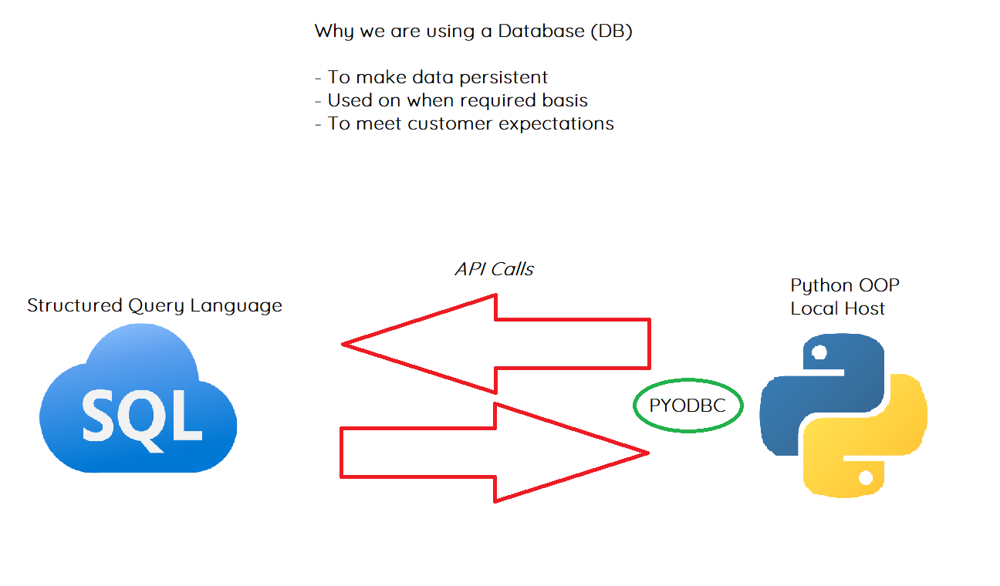

# Python-SQL

## PYODBC

- Python Open Database Connectivity
- API for connecting to an SQL Server

## Lesson Plan

- With is Cursor
- How to use it
- Functions used to interact with SQL Data
- Set up pyodbc
